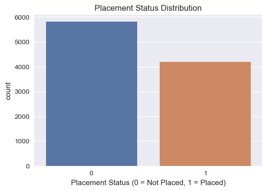
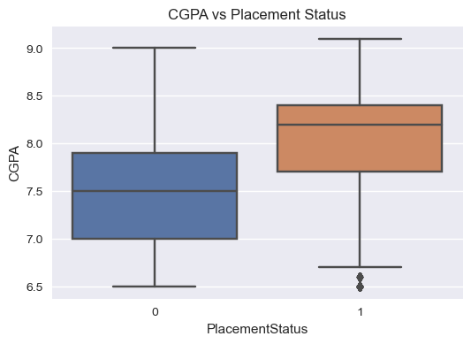
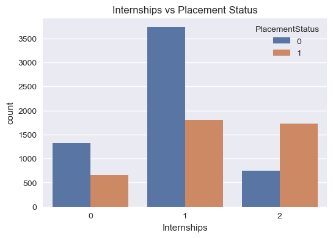

# Student Placement Prediction using Machine Learning

## Table of Contents
- [Overview](#overview)
- [Problem Statement](#problem-statement)
- [Objectives](#objectives)
- [Dataset](#dataset)
- [Exploratory Data Analysis](#exploratory-data-analysis)
- [Machine Learning Model](#machine-learning-model)
- [Results](#results)
- [Conclusion](#conclusion)
- [Installation](#installation)
- [Project Structure](#project-structure)
- [Expected Outcomes](#expected-outcomes)

---

## Overview
This project predicts whether a student will be placed or not based on academic performance, skills, and training-related attributes. It demonstrates a complete machine learning pipeline including data preprocessing, exploratory data analysis, model training, and evaluation.

---

## Problem Statement
Educational institutions and students often seek to understand which factors most significantly impact placement success. Using historical placement data, this project builds a classification model to predict student placement outcomes.

---

## Objectives
- Perform Exploratory Data Analysis (EDA) to identify trends and patterns.
- Understand the impact of academic and skill-based features on placement.
- Build a machine learning classification model.
- Evaluate model performance using standard metrics.
- Achieve accuracy greater than 60%.

---

## Dataset
The dataset contains student-level information such as:
- Academic scores (SSC, HSC, CGPA)
- Internships and project experience
- Workshops and certifications
- Aptitude test scores
- Soft skill ratings
- Placement training details

**Target Variable:**  
- `PlacementStatus` (Placed / Not Placed)

---

## Exploratory Data Analysis

### Placement Distribution


### CGPA vs Placement


### Internships vs Placement


**Key insights from EDA:**
- Students with higher CGPA have a greater likelihood of being placed.
- Internships significantly improve placement chances.
- Placement training positively influences outcomes.

---

## Machine Learning Model
- **Task:** Binary Classification
- **Algorithm:** Logistic Regression
- **Train-Test Split:** 80% training, 20% testing

Logistic Regression was chosen for its simplicity, interpretability, and effectiveness for binary classification tasks.

---

## Results
The Logistic Regression model achieved an accuracy of approximately **79.45%** on unseen test data, demonstrating strong predictive capability using academic and skill-related features.

---

## Conclusion
This project demonstrates an end-to-end machine learning workflow applied to a real-world education problem. The results show that academic performance, internships, and skill development play a crucial role in student placement outcomes.

---

## Installation
Clone the repository and install dependencies:

```bash
git clone https://github.com/SREEGOVIND3/student-placement-prediction.git
cd student-placement-prediction
pip install -r requirements.txt
```
## Project Structure
```
student-placement-prediction/
│
├── data/
│   └── placement.csv
│
├── notebooks/
│   └── student_placement_analysis.ipynb
│
├── images/
│   ├── placement_distribution.png
│   ├── cgpa_vs_placement.png
│   └── internships_vs_placement.png
│
├── requirements.txt
└── README.md
```
